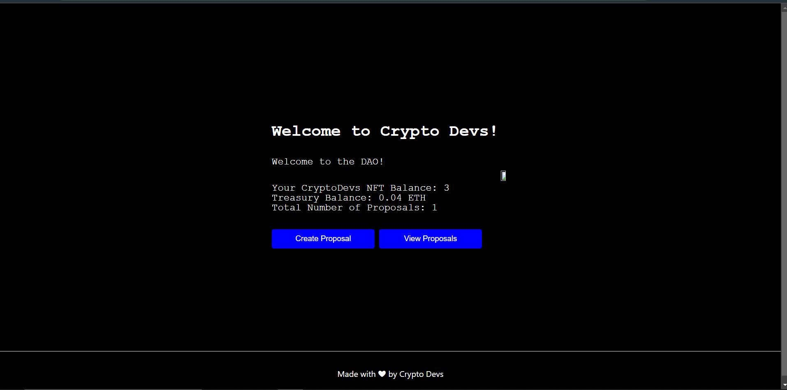
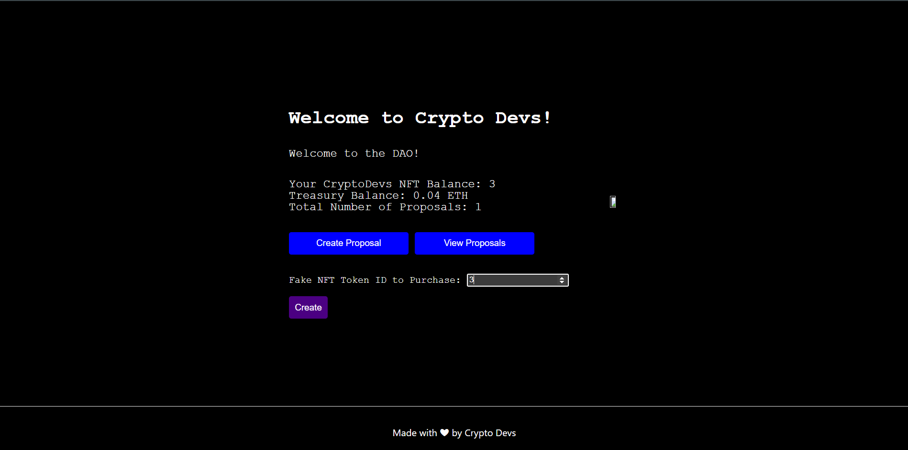
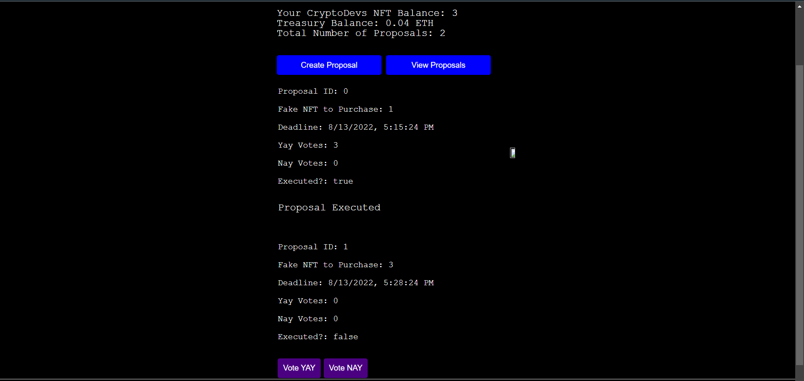

# NFT-Purchase-DAO

This is a DAO that exhibits the Good understanding of Blockchain Fundamentals
and advanced solidity topics.

This is a  Decentralized platform where any CryptoDev NFT Holder ( hold through my previous DAPP )
can create a proposal or vote for Proposal either in Yes or No.
The more NFTs you have , the more votes will be counted in.

Each proposal has a deadline of 5 minutes , associated with it.

If a proposal meets the deadline , it gets accepted or rejected based upon the number of votes for Yes or No !

### Precation
    
    Don't use your Mainnet Wallet Account
    Use Goerli Test Network
    Make sure to mint some NFTs from my Market place Dapp before continuing
    

###  Concepts Involved

    - Solidity    
            OpenZeppelin
            ERC721 Emuerable 
            Ownable
            Custom Smart contracts 
            Receiving Ether
            Mapping
            Payable Function
            Pure Function
            View Functions

    - NextJs
            Api Routing
            CSS Modules
            Use Hooks
            State management
            Conditional Rendering
            Async functions
            Timed Functions
      
    - Ethers.js
            Provider
            Signer
            Utils
            call transactions
      
    - Web3Modal
            Metamask Connection
            Web3Modal Provider

    

It illustrates how you can achieve decentralized governance.

##### Short Comings

    Right Now Governance decision is made to purchase an NFT or not , but it can be extended in the ong way
        
#### Deployment Network
    Ethereum Goerli

#### Deployment Link
https://nft-purchase-dao.vercel.app/

    
    
